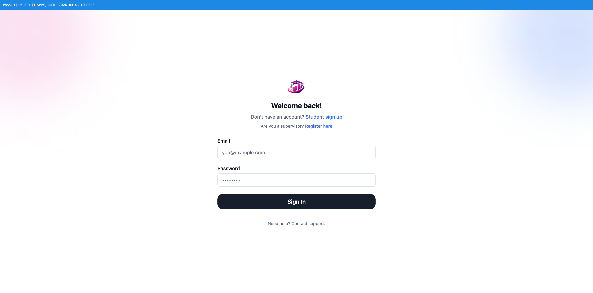
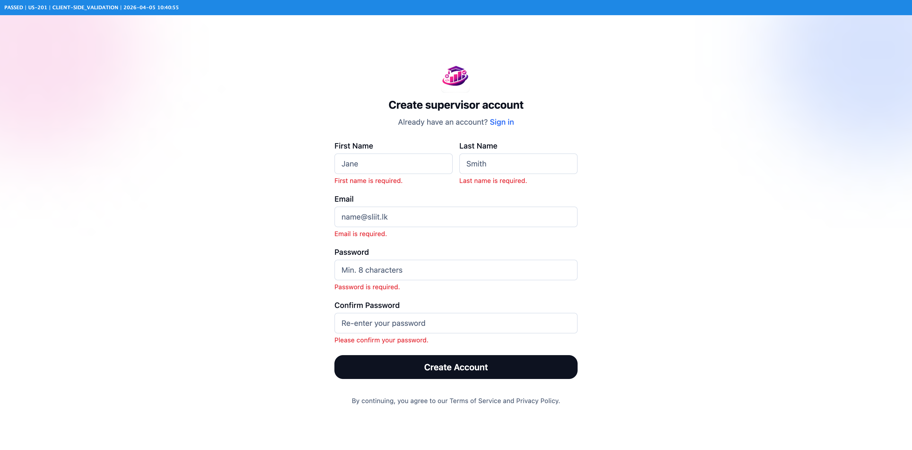
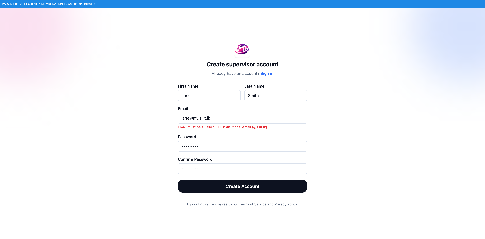
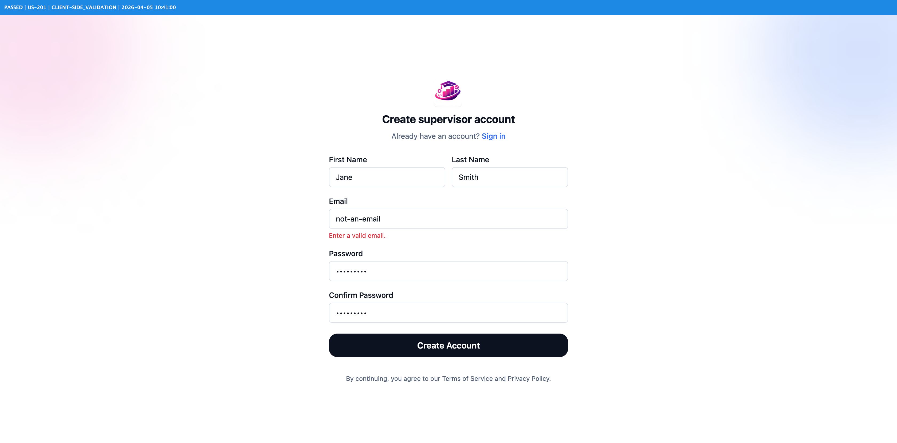
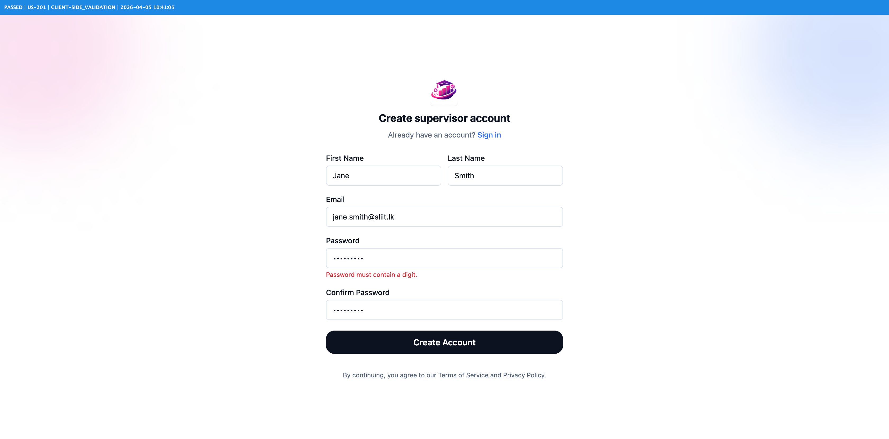
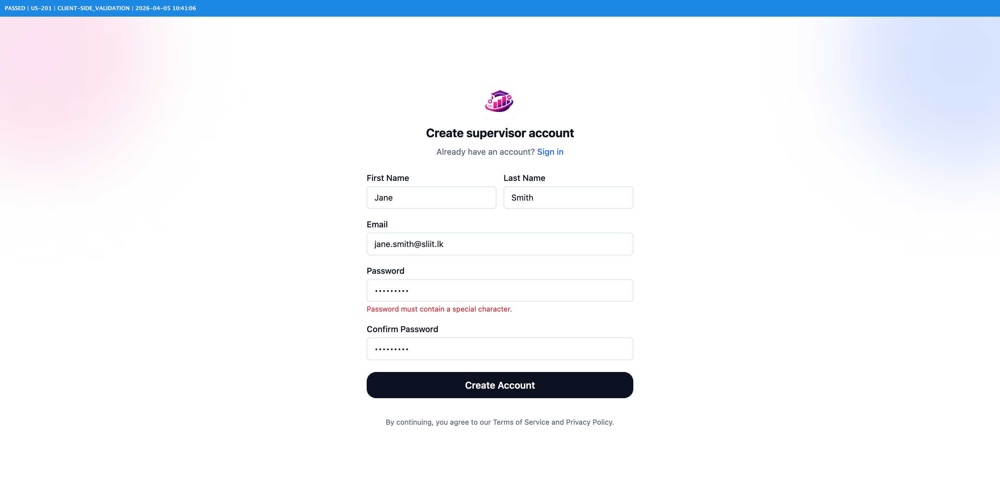
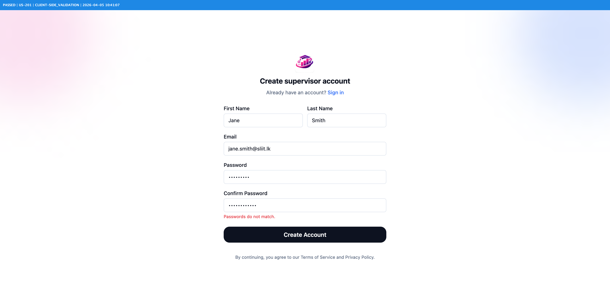
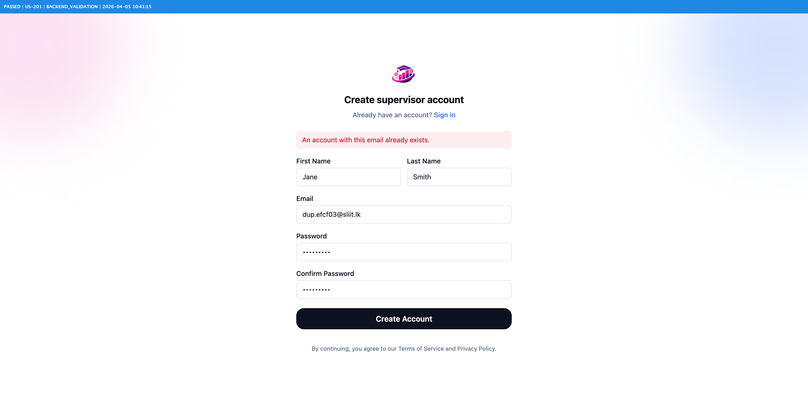
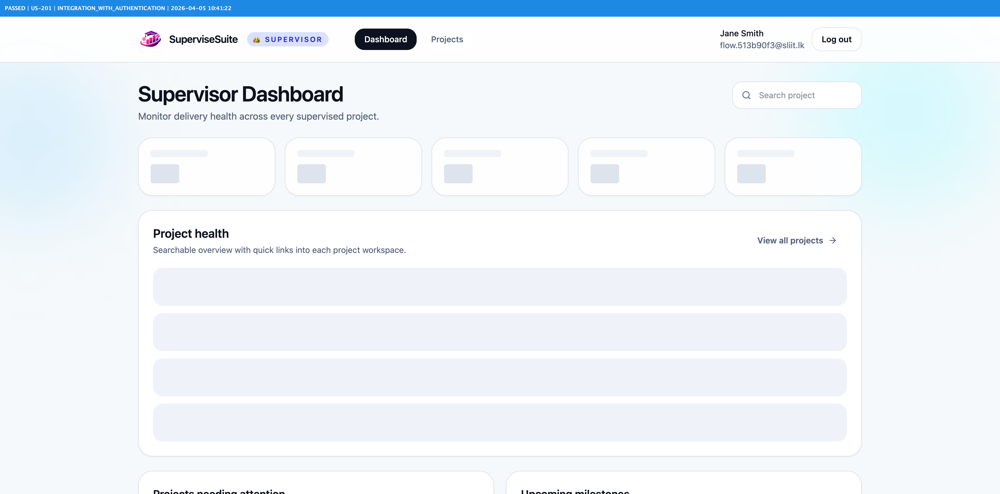

# Selenium Proof Report

| | |
|---|---|
| **Story** | `US-201` |
| **Suite** | `supervisorregistrationtest` |
| **Browser** | `chrome` |
| **Run ID** | `20260405-104042` |
| **Commit** | `9796bfd00cee5c96c11708b4710dcffd0cbf1aa5` |
| **Result** | 13 ✅ passed, 0 ❌ failed (13 total) |

## Summary

| # | Test Case | Outcome | Category | Severity |
|---|---|---|---|---|
| 1 | [TC-01: Valid data → success modal shown, then redirected to /login](#tc-01-valid-data-success-modal-shown-then-redirected-to-login-passed) | ✅ `passed` | `happy_path` | `critical` |
| 2 | [TC-02: Empty form submit → required-field errors for all five fields](#tc-02-empty-form-submit-required-field-errors-for-all-five-fields-passed) | ✅ `passed` | `client-side_validation` | `normal` |
| 3 | [TC-03: Gmail address → SLIIT institutional email domain error](#tc-03-gmail-address-sliit-institutional-email-domain-error-passed) | ✅ `passed` | `client-side_validation` | `normal` |
| 4 | [TC-04: @my.sliit.lk address → SLIIT institutional email domain error](#tc-04-mysliitlk-address-sliit-institutional-email-domain-error-passed) | ✅ `passed` | `client-side_validation` | `normal` |
| 5 | [TC-05: Malformed email string → valid email format error](#tc-05-malformed-email-string-valid-email-format-error-passed) | ✅ `passed` | `client-side_validation` | `minor` |
| 6 | [TC-06: Password < 8 chars → minimum length error](#tc-06-password-8-chars-minimum-length-error-passed) | ✅ `passed` | `client-side_validation` | `normal` |
| 7 | [TC-07: Password with no uppercase letter → uppercase required error](#tc-07-password-with-no-uppercase-letter-uppercase-required-error-passed) | ✅ `passed` | `client-side_validation` | `normal` |
| 8 | [TC-08: Password with no lowercase letter → lowercase required error](#tc-08-password-with-no-lowercase-letter-lowercase-required-error-passed) | ✅ `passed` | `client-side_validation` | `normal` |
| 9 | [TC-09: Password with no digit → digit required error](#tc-09-password-with-no-digit-digit-required-error-passed) | ✅ `passed` | `client-side_validation` | `normal` |
| 10 | [TC-10: Password with no special character → special character required error](#tc-10-password-with-no-special-character-special-character-required-error-passed) | ✅ `passed` | `client-side_validation` | `normal` |
| 11 | [TC-11: Mismatched passwords → passwords do not match error](#tc-11-mismatched-passwords-passwords-do-not-match-error-passed) | ✅ `passed` | `client-side_validation` | `normal` |
| 12 | [TC-12: Duplicate email → backend conflict error shown in general error banner](#tc-12-duplicate-email-backend-conflict-error-shown-in-general-error-banner-passed) | ✅ `passed` | `backend_validation` | `critical` |
| 13 | [TC-13: Register then login → authenticated as SUPERVISOR and redirected to supervisor dashboard](#tc-13-register-then-login-authenticated-as-supervisor-and-redirected-to-supervisor-dashboard-passed) | ✅ `passed` | `integration_with_authentication` | `blocker` |

## Test Results

### TC-01: Valid data → success modal shown, then redirected to /login — passed

| Field | Value |
|---|---|
| **Outcome** | ✅ `PASSED` |
| **Category** | `happy_path` |
| **Severity** | `critical` |
| **Captured** | `2026-04-05 10:40:54` |

**Test criteria:** Fill all fields with valid @sliit.lk credentials. Expect the success modal to appear, then an automatic redirect to /login.

---

### TC-02: Empty form submit → required-field errors for all five fields — passed

| Field | Value |
|---|---|
| **Outcome** | ✅ `PASSED` |
| **Category** | `client-side_validation` |
| **Severity** | `normal` |
| **Captured** | `2026-04-05 10:40:55` |

**Test criteria:** Submit the form without filling any field. All five required-field errors must appear.

---

### TC-03: Gmail address → SLIIT institutional email domain error — passed

| Field | Value |
|---|---|
| **Outcome** | ✅ `PASSED` |
| **Category** | `client-side_validation` |
| **Severity** | `normal` |
| **Captured** | `2026-04-05 10:40:57` |

**Test criteria:** Enter a gmail.com address. The SLIIT domain validator must reject it.

---

### TC-04: @my.sliit.lk address → SLIIT institutional email domain error — passed

| Field | Value |
|---|---|
| **Outcome** | ✅ `PASSED` |
| **Category** | `client-side_validation` |
| **Severity** | `normal` |
| **Captured** | `2026-04-05 10:40:59` |

**Test criteria:** Enter a @my.sliit.lk student portal address. Supervisors must use @sliit.lk only; the validator must reject the student domain.

---

### TC-05: Malformed email string → valid email format error — passed

| Field | Value |
|---|---|
| **Outcome** | ✅ `PASSED` |
| **Category** | `client-side_validation` |
| **Severity** | `minor` |
| **Captured** | `2026-04-05 10:41:00` |

**Test criteria:** Enter a string that is not a valid email address. The format validator must reject it.

---

### TC-06: Password < 8 chars → minimum length error — passed

| Field | Value |
|---|---|
| **Outcome** | ✅ `PASSED` |
| **Category** | `client-side_validation` |
| **Severity** | `normal` |
| **Captured** | `2026-04-05 10:41:02` |

**Test criteria:** Enter a password shorter than 8 characters. The minimum-length rule must fire.

---

### TC-07: Password with no uppercase letter → uppercase required error — passed

| Field | Value |
|---|---|
| **Outcome** | ✅ `PASSED` |
| **Category** | `client-side_validation` |
| **Severity** | `normal` |
| **Captured** | `2026-04-05 10:41:03` |

**Test criteria:** Enter a password with no uppercase letter. The strength validator must require one.

---

### TC-08: Password with no lowercase letter → lowercase required error — passed

| Field | Value |
|---|---|
| **Outcome** | ✅ `PASSED` |
| **Category** | `client-side_validation` |
| **Severity** | `normal` |
| **Captured** | `2026-04-05 10:41:04` |

**Test criteria:** Enter a password with no lowercase letter. The strength validator must require one.

---

### TC-09: Password with no digit → digit required error — passed

| Field | Value |
|---|---|
| **Outcome** | ✅ `PASSED` |
| **Category** | `client-side_validation` |
| **Severity** | `normal` |
| **Captured** | `2026-04-05 10:41:06` |

**Test criteria:** Enter a password with no numeric digit. The strength validator must require one.

---

### TC-10: Password with no special character → special character required error — passed

| Field | Value |
|---|---|
| **Outcome** | ✅ `PASSED` |
| **Category** | `client-side_validation` |
| **Severity** | `normal` |
| **Captured** | `2026-04-05 10:41:07` |

**Test criteria:** Enter a password with no special character. The strength validator must require one.

---

### TC-11: Mismatched passwords → passwords do not match error — passed

| Field | Value |
|---|---|
| **Outcome** | ✅ `PASSED` |
| **Category** | `client-side_validation` |
| **Severity** | `normal` |
| **Captured** | `2026-04-05 10:41:08` |

**Test criteria:** Enter different values for password and confirm password. The mismatch error must appear.

---

### TC-12: Duplicate email → backend conflict error shown in general error banner — passed

| Field | Value |
|---|---|
| **Outcome** | ✅ `PASSED` |
| **Category** | `backend_validation` |
| **Severity** | `critical` |
| **Captured** | `2026-04-05 10:41:16` |

**Test criteria:** Register successfully once, then attempt to register again with the same email. The backend must return a conflict error displayed in the general error banner.

---

### TC-13: Register then login → authenticated as SUPERVISOR and redirected to supervisor dashboard — passed

| Field | Value |
|---|---|
| **Outcome** | ✅ `PASSED` |
| **Category** | `integration_with_authentication` |
| **Severity** | `blocker` |
| **Captured** | `2026-04-05 10:41:22` |

**Test criteria:** Register a supervisor, then log in with the same credentials. Verify authentication succeeds, user role is SUPERVISOR, and app redirects to supervisor dashboard route.

---

